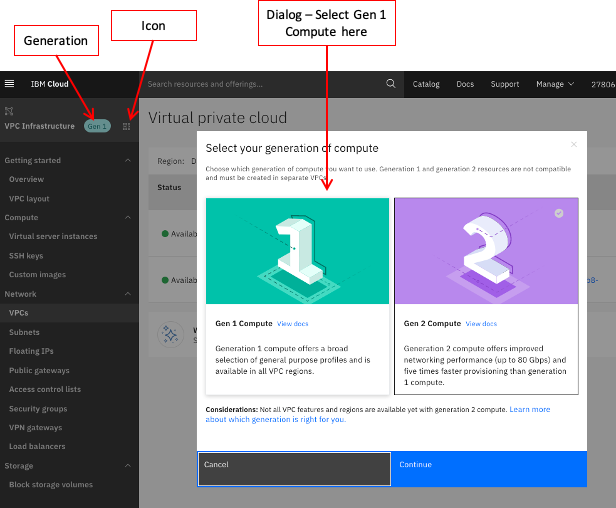

---

copyright:
  years: 2020
lastupdated: "2020-08-20"

keywords:
subcollection: vpc-on-classic

---

{:shortdesc: .shortdesc}
{:codeblock: .codeblock}
{:screen: .screen}
{:external: target="_blank" .external}
{:pre: .pre}
{:note: .note}
{:tip: .tip}
{:important: .important}
{:table: .aria-labeledby="caption"}

# About migrating from VPC (Gen 1) to VPC (Gen 2)
{: #migrating-faqs}

To continue bringing you the best service, hardware, and connectivity, IBM infrastructure is continually evaluated to ensure that it meets your networking, throughput, and redundancy requirements. The IBM Gen 1 environment, while robust, is an excellent stepping-stone to the more advanced features available in our Gen 2 environment.  

This topic includes answers to commonly asked questions about migrating from VPC (Gen 1) to VPC (Gen 2).

## What are the benefits of migrating from Gen 1 to Gen 2?
{: #migrating-faqs-benefits}

While Gen 1 and Gen 2 have many of the same features and functions, Gen 2 provides these additional benefits:

* 5X faster virtual server processing
* Up to 80 Gbps network performance on virtual server profiles
* Block storage is larger in Gen 2
* Quotas and limits are increased for some features in Gen 2; see [Gen 1 and Gen 2 Quota and Limit Comparisons](/docs/vpc-on-classic?topic=vpc-on-classic-migrating-quotas-limits) for details
* All new features, including Auto Scaling and Flow Logs for VPC, are being developed for Gen 2 only.


## When do I need to be fully migrated?
{: #migrating-faqs-when}

Migrations must be completed by the end of 2020. The fastest way to do this is to use a vendor that IBM has engaged who will work with you to provide a migration path specific to your infrastructure. Contact your IBM representative for more information.

You can also choose to perform this migration with your own resources by following the steps in our docs. If you choose to complete this migration, refer to [Instructions for Migrating from VPC (Gen 1) to VPC (Gen 2)](/docs/vpc-on-classic?topic=vpc-on-classic-migrating-vpc).

## Will I need to migrate my resources in the future (subsequent to this migration)?
{: #migrating-faqs-migrate-again}

While we continually evaluate the quality of the {{site.data.keyword.cloud_notm}} infrastructure to bring you the best and most dependable service, it is unlikely that this type of migration is needed in the future.

## Do VPC Gen 1 and Gen 2 have the same features and functions?
{: #migrating-faqs-features}

Gen 1 and Gen 2 have major feature-function parity. There is an edge case. If you are using an address space outside of the RFC1918 space in VPC Gen 1, you will not be able to create resources in that address space in Gen 2. Contact your IBM representatives to address this part of your migration if you are in this situation.

## How do I select which site to deploy to?
{: #migrating-faqs-select}

The following factors might influence which data centers you select:

* Proximity to the users of the systems
* Proximity to any other systems that this server needs to communicate with
* Any data policies or regulations that require data to be stored in a specific location

The following table gives you comparable VPC Gen 2 sites:

|VPC Gen 1|VPC Gen 2|
|-----|-----|
|us-south-1 (Dallas 1)<br>us-south-2 (Dallas 2)<br>us-south-3 (Dallas 3)|us-south-1 (Dallas 1)<br>us-south-2 (Dallas 2)<br>us-south-3 (Dallas 3)|
|eu-de-1 (Frankfurt 1)<br>eu-de-2 (Frankfurt 2)<br>eu-de-3 (Frankfurt 3)|eu-de-1 (Frankfurt 1)<br>eu-de-2 (Frankfurt 2)<br>eu-de-3 (Frankfurt 3)|
|us-east-1 (Washington DC 1)<br>us-east-2 (Washington DC 2)<br>us-east-3 (Washington DC 3)|us-east-1 (Washington DC 1)<br>us-east-2 (Washington DC 2)<br>us-east-3 (Washington DC 3)|
|eu-gb-1 (London 1)<br>eu-gb-2 (London 2)<br>eu-gb-3 (London 3)|eu-gb-1 (London 1)<br>eu-gb-2 (London 2)<br>eu-gb-3 (London 3)|
|jp-tok-1 (Tokyo 1)<br>jp-tok-2 (Tokyo 2)<br>jp-tok-3 (Tokyo 3)|jp-tok-1 (Tokyo 1)<br>jp-tok-2 (Tokyo 2)<br>jp-tok-3 (Tokyo 3)|
|au-syd-1 (Sydney 1)<br>au-syd-2 (Sydney 2)<br>au-syd-3 (Sydney 3)|Coming Soon|
{: caption="Table 1. Comparable VPC Gen 2 sites" caption-side="top"}

### How do I determine what needs to be migrated in VPC Gen 1?
{: #migrating-faqs-determine}

You can find your system configuration details by selecting your device from the list in the [Virtual Private Cloud Console](https://cloud.ibm.com/login){: external}. From this location, go to the upper left corner and click **VPC Infrastructure**.  You might have both Gen 1 and Gen 2 resources.  To switch between the two, click the icon next to **Gen 1** or **Gen 2** and Gen 1 from the dialog that appears on your screen.  Click **Continue** to go to Gen 1 resources.

Having difficulties?  Reach out to our [Client Success team](https://www.ibm.com/cloud/data-centers/?focusArea=WCP%20-%20Pooled%20CSM&contactmodule){: external}.

{:caption="Figure 1. Determine Gen 1 resources to migrate" caption-side="bottom"}

For more information, contact the [Client Success team](https://www.ibm.com/cloud/data-centers/?focusArea=WCP%20-%20Pooled%20CSM&contactmodule){: external}.

## How do I determine what is in VPC Gen 1 that needs to be migrated by using an API or CLI?
{: #migrating-faqs-api-cli}

Use the following API to determine your instance type:

```
curl -X GET "$rias_endpoint/v1/instance/profiles?version=2020-08-11&generation=1" -H "Authorization: $iam_token"
```
{: pre}

Use the following CLI to determine your instance type:

```
ibmcloud is target --gen 1
```
{: pre}

```
ibmcloud is instances
```
{: pre}

## Can I keep my existing IP addresses?  
{: #migrating-faqs-ip-addresses}

Your new servers come with new primary IP subnets. Your current IP addresses cannot be transferred. If you need more IP addresses, you can request those directly from the console. Indicate that you are migrating your resources to a new data center.

* For more information about VPC subnets, see [Bring your own subnet](/docs/vpc?topic=vpc-configuring-address-prefixes).
* For more information about classic infrastructure subnets, see [Getting started with subnets and IPs](/docs/subnets?topic=subnets-getting-started).

## I am currently using an IBM Kubernetes service (IKS).  How does that fit into this migration?  
{: #migrating-faqs-iks}

We have a guide for migrating IKS clusters from VPC Gen 1 to VPC Gen 2. See [Migrating cluster resources from VPC Gen 1 to VPC Gen 2](/docs/containers?topic=containers-vpc_migrate_tutorial).
